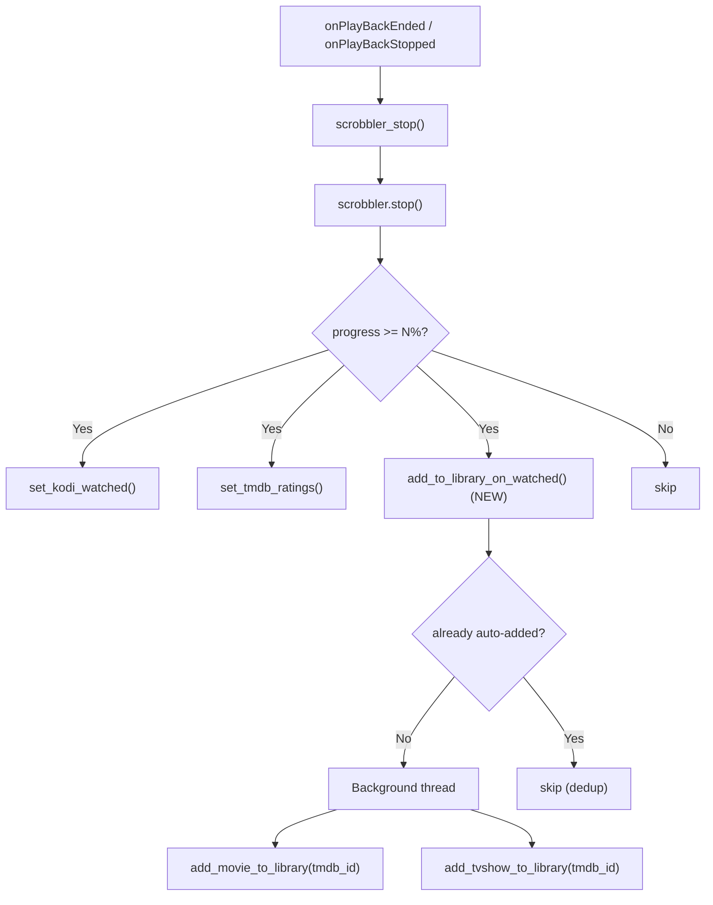

# Auto-Add to Library on Playback

## Architecture

The feature hooks into the existing `PlayerScrobbler.stop()` flow -- the same place that already handles `set_kodi_watched()` and `set_tmdb_ratings()` when progress >= threshold. A new method `add_to_library_on_watched()` runs alongside these, reusing the scrobbler's already-resolved `tmdb_id`, `tmdb_type`, `season`, and `episode`.




## Key Design Decisions

- **TV shows**: Adding any episode auto-adds the **entire TV show** (all seasons/episodes), so the full series appears in the library for future browsing.
- **Threshold**: Configurable via settings (integer slider, 10-100%, default TBD by user). Stored as `library_autoadd_threshold`.
- **Deduplication**: Track auto-added `tmdb_id`s in a simple JSON file under `addon_data` to avoid redundant API calls on repeat viewings of the same show.
- **Background execution**: The library builder runs on a background thread (Python `threading.Thread`) to avoid blocking Kodi UI or next playback.
- **Library scan**: Relies on the existing `auto_update` setting (already in the builder's `__exit__`), which calls `UpdateLibrary('video')`.
- **Independent of Trakt**: Works regardless of Trakt authorization -- only requires `tmdb_id` and `tmdb_type` from `PlayerInfoString`.

## .nfo Files and Player Resolution (Already Handled)

### .nfo files are created by the existing library builders

The plan reuses `add_movie_to_library(tmdb_id)` and `add_tvshow_to_library(tmdb_id)` -- the same functions the manual "Add to Library" uses. These already create .nfo files via `LibraryMedia.info_filewriter`:

- **Movies**: `movie.nfo` (or `movie-tmdbhelper.nfo` if `alternative_nfo` setting is on) containing `https://www.themoviedb.org/movie/{tmdb_id}` -- created at `{basedir}/{Movie Title (Year)}/movie.nfo`
- **TV shows**: `tvshow.nfo` containing `https://www.themoviedb.org/tv/{tmdb_id}` -- created at `{basedir}/{Show Title (Year)}/tvshow.nfo`
- **Episodes**: No per-episode .nfo (correct -- Kodi identifies episodes by the show-level .nfo + S01E01 naming pattern)

No additional work needed for .nfo files.

### Player resolution is handled by the .strm URL format

The .strm files contain `plugin://plugin.video.themoviedb.helper/?info=play&tmdb_id=X&tmdb_type=Y&islocal=True`. When Kodi plays a .strm from the library:

1. Kodi reads the .strm and calls the plugin URL
2. `Router.run()` sees `info=play` and calls `play_player()` (`resources/tmdbhelper/lib/items/router.py`)
3. This enters the full player resolution pipeline (`resources/tmdbhelper/lib/player/dialog/player.py`)
4. The pipeline checks `default_player_movies` / `default_player_episodes` settings
5. If a default player is configured (e.g., Seren, Fen, or any other resolver addon), that player is used

The `islocal=True` parameter marks the playback as library-sourced. The user's configured default player is always respected. No additional work needed.

## Files to Modify

### 1. New file: [`resources/tmdbhelper/lib/monitor/libadd.py`](resources/tmdbhelper/lib/monitor/libadd.py)

New module containing the auto-add logic AND the pending-watched queue:

```python
import threading
from tmdbhelper.lib.addon.plugin import get_setting
from tmdbhelper.lib.addon.logger import kodi_log
from tmdbhelper.lib.files.futils import read_json, write_json

AUTOADDED_FILENAME = 'library_autoadded.json'
PENDING_WATCHED_FILENAME = 'library_pending_watched.json'

def _load_json(filename):
    """Load JSON data from addon_data."""
    ...

def _save_json(filename, data):
    """Persist JSON data to addon_data."""
    ...

def add_to_library_on_watched(tmdb_type, tmdb_id, season=0, episode=0):
    """Called from scrobbler.stop() when threshold met."""
    if not get_setting('library_autoadd_on_play'):
        return
    if not tmdb_type or not tmdb_id:
        return

    key = f'{tmdb_type}.{tmdb_id}'
    autoadded = _load_json(AUTOADDED_FILENAME)
    if key in autoadded:
        return

    kodi_log(f'LIBRARY AUTO-ADD: {key}', 2)
    autoadded[key] = True
    _save_json(AUTOADDED_FILENAME, autoadded)

    # Queue the item for post-scan watched marking
    _queue_pending_watched(tmdb_type, tmdb_id, season, episode)

    # Run library builder on background thread
    thread = threading.Thread(
        target=_do_add, args=(tmdb_type, tmdb_id), daemon=True)
    thread.start()

def _queue_pending_watched(tmdb_type, tmdb_id, season=0, episode=0):
    """Add item to pending-watched queue for post-scan processing."""
    pending = _load_json(PENDING_WATCHED_FILENAME)
    item = {'tmdb_type': tmdb_type, 'tmdb_id': tmdb_id,
            'season': season, 'episode': episode}
    content_id = f'{tmdb_type}.{tmdb_id}.{season}.{episode}'
    pending[content_id] = item
    _save_json(PENDING_WATCHED_FILENAME, pending)

def process_pending_watched():
    """Called from UpdateMonitor.onScanFinished() to mark queued items as watched."""
    pending = _load_json(PENDING_WATCHED_FILENAME)
    if not pending:
        return
    import tmdbhelper.lib.api.kodi.rpc as rpc
    processed = []
    for content_id, item in pending.items():
        tmdb_type = item['tmdb_type']
        tmdb_id = item['tmdb_id']
        season = item.get('season', 0)
        episode = item.get('episode', 0)
        dbid = _find_dbid(rpc, tmdb_type, tmdb_id, season, episode)
        if dbid:
            dbtype = 'episode' if tmdb_type == 'tv' else 'movie'
            rpc.set_watched(dbid=dbid, dbtype=dbtype)
            kodi_log(f'LIBRARY AUTO-ADD: [Watched] {content_id}', 2)
            processed.append(content_id)
    for cid in processed:
        del pending[cid]
    _save_json(PENDING_WATCHED_FILENAME, pending)

def _do_add(tmdb_type, tmdb_id):
    from tmdbhelper.lib.script.method.library import (
        add_movie_to_library, add_tvshow_to_library)
    if tmdb_type == 'movie':
        add_movie_to_library(tmdb_id)
    elif tmdb_type == 'tv':
        add_tvshow_to_library(tmdb_id)
```

### 2. Modify: [`resources/tmdbhelper/lib/monitor/scrobbler.py`](resources/tmdbhelper/lib/monitor/scrobbler.py)

Add `add_to_library_on_watched()` call in the `stop()` method, after `set_kodi_watched()` and `set_tmdb_ratings()`. Uses a configurable threshold instead of the hardcoded 80%.

In `stop()` (around line 147-155), add:

```python
self.add_to_library_on_watched()
```

New method on `PlayerScrobbler`:

```python
@is_scrobbling
def add_to_library_on_watched(self):
    threshold = get_setting('library_autoadd_threshold', 'int') or 80
    if self.progress < threshold:
        return
    from tmdbhelper.lib.monitor.libadd import add_to_library_on_watched
    add_to_library_on_watched(self.tmdb_type, self.tmdb_id, self.season, self.episode)
```

**Note**: The `@is_scrobbling` decorator only checks `tmdb_type`, `tmdb_id`, `total_time`, and `stopped` -- it does NOT require Trakt auth (that's the separate `@is_trakt_authorized` decorator). So this works without Trakt.

### 3. Modify: [`resources/tmdbhelper/lib/monitor/update.py`](resources/tmdbhelper/lib/monitor/update.py)

Extend `UpdateMonitor.onScanFinished()` to process the pending-watched queue after the library tagger:

```python
def onScanFinished(self, library):
    if library == 'video':
        self.run_library_tagger()
        self.run_pending_watched()

@staticmethod
def run_pending_watched():
    from tmdbhelper.lib.addon.thread import SafeThread
    from tmdbhelper.lib.monitor.libadd import process_pending_watched
    SafeThread(target=process_pending_watched).start()
```

This runs on a background thread after every video library scan and marks any queued items as watched.

### 4. Modify: [`resources/settings.xml`](resources/settings.xml)

Add new settings in the Library category (group 1, after the existing auto-update settings around line 357):

- **`library_autoadd_on_play`** (boolean): "Automatically add to library after watching" -- master toggle
- **`library_autoadd_threshold`** (integer slider): "Minimum watched percentage" -- 10 to 100, step 5, default chosen by user
- Both use `<dependencies>` so the threshold is only enabled when the toggle is on.

### 5. Modify: [`resources/language/resource.language.en_gb/strings.po`](resources/language/resource.language.en_gb/strings.po)

Add localized string entries for the two new settings labels (find the next available msgctxt ID).

## Trakt Sync Consistency Analysis

### No conflicts with existing Trakt sync

The Trakt integration has three independent paths, none of which conflict with auto-add:

- **Scrobbling** (Kodi -> Trakt): Runs in `stop()` BEFORE `add_to_library_on_watched()`. By the time auto-add triggers, Trakt already has the correct watched status.
- **Sync data** (Trakt -> addon display): `SyncData` fetches watched/progress data from Trakt into `ItemDetails.db` (simplecache). This is read-only for display when `trakt_watchedindicators` is enabled. Auto-add does not touch this cache.
- **Manual sync** (context menu -> Trakt): Independent `sync/history` POST. Unaffected.

### Watched status tracking flow (complete)

```
1. User watches >= N% of a movie/episode
2. stop() fires:
   a. trakt_scrobbling('stop')         -> Trakt has watched status
   b. set_kodi_watched()               -> If already in Kodi DB: marked watched.
                                           If NOT in DB (first watch): no-op.
   c. set_tmdb_ratings()               -> TMDb rating prompt if enabled
   d. update_stats()                   -> Trakt stats refreshed
   e. add_to_library_on_watched() NEW  -> Dedup check, queue pending-watched,
                                           background: create .strm/.nfo + UpdateLibrary
3. Kodi scans new .strm files (async)
4. onScanFinished() fires:
   a. run_library_tagger()             -> Existing tag processing
   b. run_pending_watched() NEW        -> Finds queued item in Kodi DB,
                                           calls set_watched(dbid, dbtype)
5. Result: Item is in library AND marked as watched in Kodi DB
```

### Subsequent watches (item already in library)

When the item is already in the Kodi library (e.g., watching episode 2 of a previously added show):
- `set_kodi_watched()` finds the `dbid` immediately and marks it watched in step 2b
- `add_to_library_on_watched()` hits the dedup cache and skips (same `tv.{tmdb_id}` key)
- No pending-watched queue entry needed
- No conflicts

### What the addon does NOT do (pre-existing limitations, not introduced by us)

- **No Trakt -> Kodi library watched sync**: The addon never bulk-syncs Trakt watched history into the Kodi library DB. If a user marks something watched on Trakt.tv directly, it won't reflect in Kodi's library playcount.
- **No Kodi -> Trakt push from library**: Manually marking something watched in Kodi's library does not push to Trakt. Only playback scrobbling does.

## Edge Cases Handled

- **Binge-watching**: After episode 1 triggers `add_tvshow_to_library`, episodes 2-N are skipped by the dedup cache (same `tv.{tmdb_id}` key). But `set_kodi_watched()` still marks each episode watched individually (already in DB from the show being added).
- **Re-watching**: Dedup cache skips redundant library adds. Kodi watched status is updated via the normal `set_kodi_watched()` path (item already in DB).
- **Short content (trailers, etc.)**: The `@is_scrobbling` decorator requires `total_time > 0` and valid `tmdb_type`/`tmdb_id`. Random short videos without TMDb metadata won't trigger it.
- **Non-TMDb-Helper playback**: `PlayerInfoString` is only set when playing through this addon, so library playback or other addon playback is naturally excluded.
- **Existing library items**: `LibraryBuilderMovies`/`LibraryBuilderTvshows` already skip items with existing .strm files, so no duplicates.
- **Pending queue persistence**: If Kodi restarts before `onScanFinished` fires, the JSON file persists and will be processed on the next scan.
- **Movies vs episodes in pending queue**: For movies, `season=0, episode=0`. For episodes, the specific season/episode is stored so the correct episode is marked watched. For TV shows (full show added), only the triggering episode is queued as pending-watched (the rest are unwatched, which is correct).
- **Failed API calls**: The builder has built-in error handling. If it fails, the dedup cache has the key, so it won't retry. A "clear auto-add cache" maintenance action could be added later.

## What This Does NOT Change

- The existing manual "Add to library" context menu and script commands remain unchanged.
- The existing Trakt scrobbling, cron autoupdate, and monitored user lists are unaffected.
- No changes to the plugin routing, service monitor, or player dialog.

